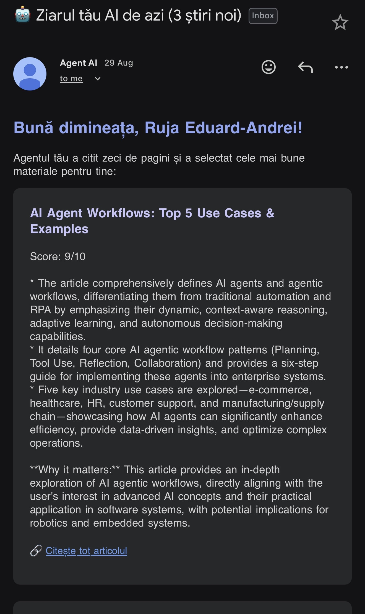

# AI News Curator (Agent Stiri AI)

This application is an automated, personalized daily news curator. It uses an AI agent to search, read, evaluate, and summarize articles based on your specific interests, sending a compiled email newsletter to you every morning.

## What is this app all about?

The app runs an autonomous agent workflow that performs the following tasks:
1. **Search**: Uses [Tavily](https://tavily.com/) to find the latest articles about AI agentic workflows.
2. **Scrape**: Reads the text content of the search results using [Firecrawl](https://firecrawl.dev/).
3. **Analyze & Filter**: Uses Google's **Gemini** to evaluate the content against a specific profile of user interests (Software development, AI, robotics, football analytics, etc.). If the article scores 7/10 or higher for relevance, it gets summarized.
4. **Deliver**: Compiles the summaries and sends a beautifully formatted email using [Resend](https://resend.com/) with all the relevant news.

This entire process is orchestrated as a cron job (running daily at 8:00 AM) using [Inngest](https://www.inngest.com/) and served via an [Express.js](https://expressjs.com/) server.

## Prerequisites

Before running the application, make sure you have [Node.js](https://nodejs.org/) installed on your machine.

You will also need to create accounts and get API keys for the following services:
- [Tavily](https://tavily.com/) (Web Search API)
- [Firecrawl](https://firecrawl.dev/) (Web Scraping API)
- [Google Gemini](https://ai.google.dev/) (LLM API)
- [Resend](https://resend.com/) (Email API)

## Installation

1. Open a terminal in the project directory (`d:\ai news`).
2. Install the required dependencies:
   ```bash
   npm install
   ```

## Configuration

The app relies on environment variables to store your secure API keys. 

1. Ensure there is a `.env` file in the root of the project.
2. Add all of your API keys to the `.env` file like this:

   ```env
   TAVILY_API_KEY=your_tavily_api_key_here
   FIRECRAWL_API_KEY=your_firecrawl_api_key_here
   GEMINI_API_KEY=your_gemini_api_key_here
   RESEND_API_KEY=your_resend_api_key_here
   ```

## How to Start

1. **Start the Express server:**
   ```bash
   node index.js
   ```
   *You should see a message saying "🚀 Serverul este pornit pe portul 3000..."*

2. **Run Inngest Locally (To test the workflow immediately):**
   Open a new terminal window in the project folder and run:
   ```bash
   npx inngest-cli@latest dev
   ```
   *This will open the Inngest dashboard locally (usually at `http://localhost:8288`). From there, you can manually trigger the `trimite-ziar-dimineata` function instead of waiting for it to run at 8:00 AM.*

## Project Structure

- `index.js`: The main application file containing the Express server, the Inngest background job, and the AI agent logic.
- `package.json`: Contains the node dependencies for the app.
- `.env`: Stores environment variables securely.


